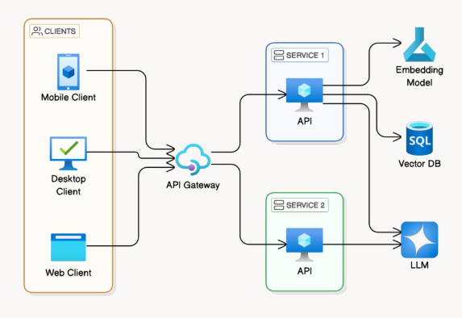

# GenAiSearch

This project was generated using [Angular CLI](https://github.com/angular/angular-cli) version 21.0.1.

# Motivation

Inspiriert vom 
  - "Build Your First Chatbot" auf der [NG-DE](https://ng-de.org/#workshops)
  - [Dieser UI-Vorlage](https://github.com/arnonym/eon-mcp-workshop/tree/main/packages/ui)
  - Semantic AI-Meetup-Beitrag von [Thinktecture](https://www.thinktecture.com/contributions/semantic-ai-a-language-model-amp-an-embedding-model-walk-into-a-bar-generation-ai-meetup/)
  - Und dem sehr aktuellen https://angular.dev/events/v21

Habe ich begonnen, ein Konstrukt zu bauen, welches der Vorstellung von Christian Weyer nahekommt:

In diesem Repo befindet sich ein Webclient, der eine Session mit einem API-Server eröffnet und per Text + Sprache mit einem LLM kommuniziert.

Die Api-Server-Komponente ist in einem separaten Repo zu finden und aktuell WIP. 

Gleichzeitig wird das Repo Versuchsort sein, neue Angular-Features zu probieren.

# Techstack
- Entwickelt mit Angular 21 nach Domain Driven Design
- Deployed mit Serverless 4 und github workflows in die AWS
